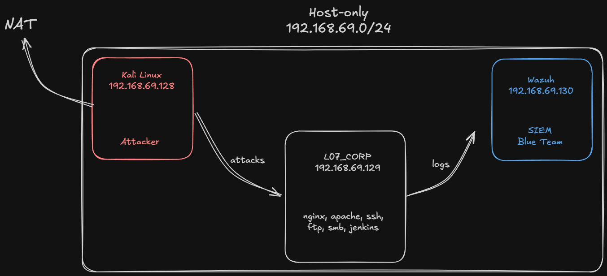

# L07_WIRED: Offensive & Defensive Security Home Lab

**L07_WIRED** is a self-contained home lab built on VMware Workstation, designed to simulate a corporate environment for offensive security and defensive monitoring.

The lab includes a vulnerable target server running real services and a configured SIEM collecting and correlating events in real time.

---
## Target Services (`L07_CORP`)

| Port  |    Service    |         Description         |
| :---: | :-----------: | :-------------------------: |
|  21   |      FTP      | vsftpd with anonymous login |
|  22   |      SSH      |           OpenSSH           |
|  80   |     HTTP      |      Nginx web server       |
|  445  |      SMB      |         Samba share         |
| 8080  |    Jenkins    |       CI/CD (Docker)        |
| 8081  |     HTTP      |     Apache2 web server      |
| 50000 | Jenkins Agent |     Communication port      |

---
## Attack Flow

The lab is designed with a specific kill chain in mind, requiring the attacker to pivot through multiple services to achieve full compromise.

---
## Defensive Monitoring

The lab uses **Wazuh** as the SIEM, with an agent deployed on L07_CORP shipping logs in real time.

### Monitoring Sources

| Source  |                      Log                      |
| :-----: | :-------------------------------------------: |
| **SSH** |                  `journald`                   |
|   FTP   |             `/var/log/vsftpd.log`             |
|  Nginx  |          `/var/log/nginx/access.log`          |
| Apache2 |         `/var/log/apache2/access.log`         |
|   SMB   |     `journald (PAM)` and `vfs_full_audit`     |
| Jenkins | `/var/jenkins_home/logs` (Audit Trail Plugin) |

### Custom Decoders & Rules

To effectively monitor the attack flow and catch specific behaviors, custom decoders and rules were developed to parse raw application logs and trigger actionable alerts.

**[Custom Decoders](./wazuh/custom_decoders/)**: Built with PCRE2 regular expressions to extract key fields (`srcuser`, `filename`, `srcip`) from raw Jenkins, Samba, and FTP logs. Includes modular parent/child decoders (Custom Samba Decoder) to handle complex log structures.

**[Custom Rules](./wazuh/local_rules.xml)**: Configured to evaluate the decoded fields, filter by `program_name` for performance, and trigger alerts mapped directly to the MITRE ATT&CK framework.

| Rule ID |           Description           | Level | MITRE |
| :-----: | :-----------------------------: | :---: | :---: |
| 100001  |  FTP anonymous login detected   |  10   | T1078 |
| 100002  |   FTP file download detected    |  10   | T1078 |
| 100100  |    Jenkins Audit Trail event    |   3   |   -   |
| 100101  |  Jenkins Script Console Access  |  10   | T1059 |
| 100102  | Jenkins Groovy Script Execution |  12   | T1059 |
| 100200  |   Samba file access detected    |   5   |   -   |
| 100201  | Samba continuous file activity  |   5   | T1039 |

---
## Setup & Requirements
### Infrastructure Requirements
- **Hypervisor:** VMware Workstation
- **RAM:** 20 GB
- **Disk Space:** 60 GB free space
### Virtual Machines
- **Attacker:** Kali Linux ISO
- **Target:** Ubuntu Server 24.04 ISO (`L07_CORP`)
- **SIEM:** Wazuh OVA (v4.14.5)
